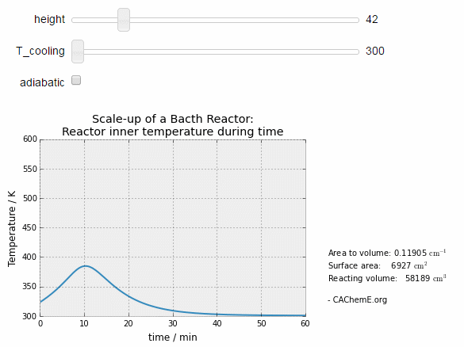
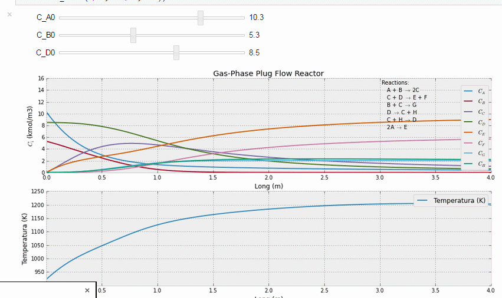

# Chemical and Process Engineering Interactive Simulations

[We](http://cacheme.org) are preparing interactive IPython/Jupyter notebooks with simulations for chemical and process engineering courses and posting them in this repository. These simulations will allow the user to change equation parameters —using just sliders and buttons— in order to obtain a better understanding of the system being modeled.

:fire: **NEW!** [Try this code on your web-browser, no installation required!](http://mybinder.org/repo/CAChemE/learn)

 Since we are using [IPython/Jupyter Notebooks](http://jupyter.org/), you  can also reproduce and modify them installing [Anaconda](http://continuum.io/downloads) (a completely free Python distribution, including for commercial use and redistribution).

## TL;DR
We want to reproduce [this work](http://www.learncheme.com/home) (learnChemE.com) with [this technology](http://www.nature.com/news/ipython-interactive-demo-7.21492) (Nature and IPython)

---

## Some examples

#### [Heterogeneous Batch Stirred Tank Reactor](http://nbviewer.ipython.org/github/CAChemE/learn/blob/master/Stirred-Tank-Reactor/Heterogeneous-batch-STR.ipynb)

#### [Tube Diameter effect on Plug Flow Reactors](http://nbviewer.ipython.org/github/CAChemE/learn/blob/master/Plug-Flow-Reactor/diameter-effect-on-PFR.ipynb)

## Other examples (in Spanish)
#### [Scale-Up of a Batch Reactor](http://nbviewer.ipython.org/github/CAChemE/learn/blob/master/Scale-Up/Batch-Reactor.ipynb)

#### [Gas-phase Plug Flow Reactor](http://nbviewer.ipython.org/github/CAChemE/learn/blob/master/Plug-Flow-Reactor/gas-PFR.ipynb)

#### [Langmuir adsorption model](http://nbviewer.ipython.org/github/CAChemE/learn/blob/master/Adsorption/Langmuir-adsorption-python%20.ipynb)

